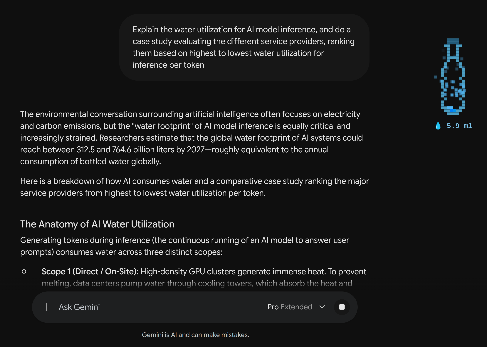
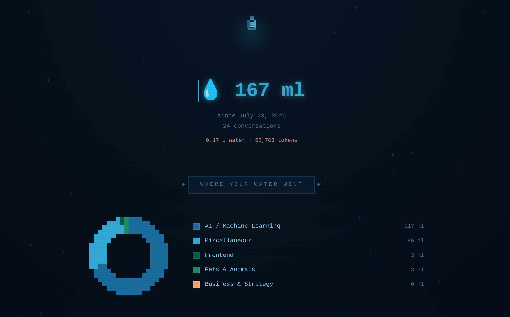
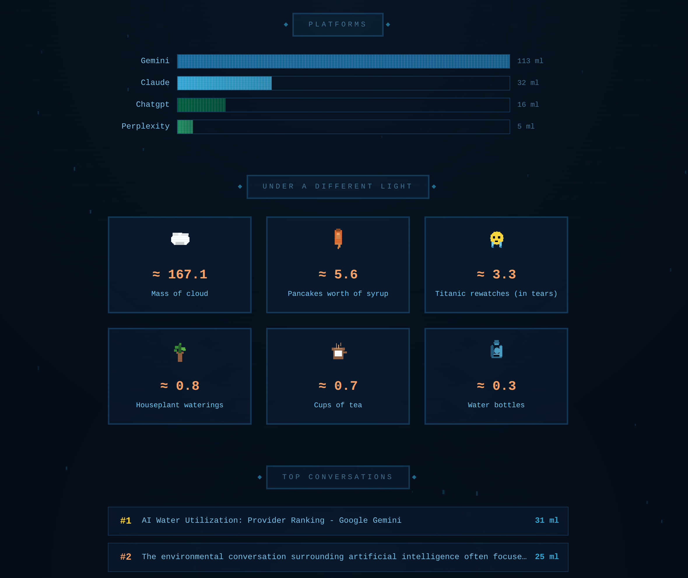
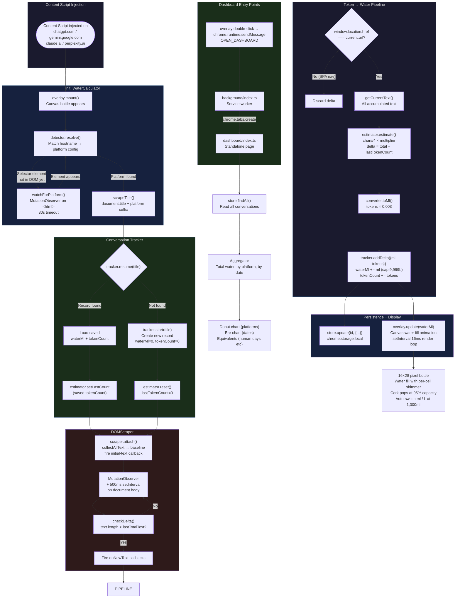

# Token-WUEr

<p align="center">
  
</p>

<p align="center">
  <strong>See how much water your AI chats consume - right on the page.</strong>
</p>

<p align="center">
  <em>Token-WUEr: bringing WUE (Water Usage Effectiveness) down to the last token - because your AI has a drinking problem it's not telling you about.</em>
</p>

<p align="center">
  
  
  
</p>

A Chrome extension that estimates the real-world water footprint of your LLM
conversations by converting token counts into milliliters of water consumed
during inference. A floating pixel-art water bottle fills up as you chat, and
a dashboard shows your water usage across platforms, topics, and time.

**0.003 ml per token** - based on peer-reviewed research (Li et al. 2023,
Patterson et al. 2022). That's roughly a 500ml water bottle for every
~167,000 tokens.

---

## Features

- **Floating overlay** - a draggable pixel-art water bottle that fills up in
  real time as AI responses stream in
- **Dashboard** - breakdown by platform, topic, and conversation with
  donut charts, bar charts, and pixel-art equivalents
- **Privacy-first** - all data stays in your browser using
  `chrome.storage.local`; no servers, no tracking
- **4 platforms** - ChatGPT, Gemini, Claude, and Perplexity - all verified working
- **Live tracking** - `MutationObserver` + polling captures streaming
  responses with ~10% estimation error
- **Session-aware** - right-click the bottle to set a custom capacity (e.g., 500ml for a single chat, 2000ml for a workday). The bottle fills against your limit, cork pops at 95%.

<p align="center">
  
</p>

## Quick Start

**Works on Linux, macOS, and Windows.** You'll need [Node.js](https://nodejs.org) and Chrome (or any Chromium browser — Brave, Edge, Arc).

```bash
git clone https://github.com/ytann/token-wuer.git
cd token-wuer
npm install
npm run build
```

Then:

1. Open `chrome://extensions`
2. Enable **Developer mode** (top-right toggle)
3. Click **Load unpacked** and select the `dist/` folder

## Privacy

**Your data never leaves your machine.** Everything is stored locally in your
browser using `chrome.storage.local`. There are no accounts, no servers, no
analytics, no tracking. You can inspect every line of code - the extension
only reads DOM text from LLM pages and writes usage stats to your local
browser storage. Nobody else sees your conversations or your water numbers.
It's just you and your data.

## Screenshots

<p align="center">
  
  <br><em>The water bottle overlay tracks usage in real time on any LLM page</em>
</p>

<p align="center">
  
  <br><em>Dashboard - hero stats, topic donut chart, and platform bars</em>
</p>

<p align="center">
  
  <br><em>Equivalents, top conversations, and footer</em>
</p>

## How It Works



| Step | Module | What happens |
|------|--------|-------------|
| Detect | `detector.ts` | Matches current hostname to a platform config |
| Scrape | `scraper.ts` | Extracts assistant text from the DOM via `MutationObserver` + 500ms polling |
| Estimate | `estimator.ts` | Char-based heuristic (~4 chars/token), returns diff to prevent double-counting |
| Convert | `converter.ts` | Applies 0.003 ml/token ratio |
| Display | `overlay.ts` | Animates a Canvas 2D pixel-art bottle, with cork-pop at 95% capacity |
| Persist | `db.ts` | Saves conversations to `chrome.storage.local` |
| Analyze | `dashboard/` | Standalone dashboard page with donut charts, bar charts, and equivalents |

## Project Structure

```
src/
├── shared/            # Types, constants, storage
├── content/           # Content script (injected into LLM pages)
│   ├── index.ts       # Orchestrator
│   ├── detector.ts    # Platform detection
│   ├── scraper.ts     # DOM text extraction
│   ├── estimator.ts   # Token estimation
│   ├── converter.ts   # Token → water
│   ├── overlay.ts     # Canvas 2D bottle UI
│   └── tracker.ts     # Conversation lifecycle
├── dashboard/         # Standalone dashboard page (charts, equivalents)
├── background/        # Service worker (message relay)
└── tests/             # Vitest test suite (mirrors src/)
```

## Architecture

- **Interface-first OOP** - every module exposes an interface in
  `shared/types.ts`, with a single class implementing it
- **Constructor injection** - dependencies are passed in, making modules
  self-contained and independently testable
- **No circular imports** - all shared types flow through `shared/types.ts`,
  all storage through `shared/db.ts`

## Design Decisions

All architectural decisions are documented in [`docs/PROJECT_MANIFEST.md`](docs/PROJECT_MANIFEST.md).
Highlights:

| Decision | Why |
|----------|-----|
| DOM scraping over network interception | Won't trigger CSP/ToS violations |
| Manifest V3, Chrome-first | Latest standard; Brave shares the engine |
| Char-based heuristic (~4 chars/token) with per-platform multipliers | Accounts for input tokens + tokenizer accuracy per platform (1.3–1.5×) |
| Re-tokenize full text each delta | Prevents double-counting during DOM rewrites |
| `setInterval` over `requestAnimationFrame` | Race-free render loop when tab is backgrounded |
| `chrome.storage.local` over IndexedDB | Survives cache clears; shared across extension contexts |

## Citations

- Li, P., Yang, J., Islam, M. A., & Ren, S. (2023). *Making AI Less "Thirsty":
  Uncovering and Addressing the Secret Water Footprint of AI Models.*
  arXiv:2304.03271.
- Patterson, D., Gonzalez, J., Hölzle, U., Le, Q., Liang, C., Munguia, L.-M.,
  Rothchild, D., So, D., Texier, M., & Dean, J. (2022). *The Carbon Footprint
  of Machine Learning Training Will Plateau, Then Shrink.* IEEE Computer.

## Development Water Footprint

Building Token-WUEr consumed an estimated **~4–6 liters** of water across AI
conversations during development (roughly 8–12 standard 500ml bottles). The
final source code itself contains ~145K tokens (~435ml), but the iterative
process - debugging, refactoring, design discussions, and false starts -
multiplies the total many times over. Every AI-assisted project has a hidden
water bill; this one is at least honest about it.

## Contributing

Contributions are welcome - new platforms, better estimators, UI polish,
whatever you've got. See [`CONTRIBUTING.md`](CONTRIBUTING.md) for setup,
conventions, and gotchas.

## License

MIT - see [`LICENSE`](LICENSE).
