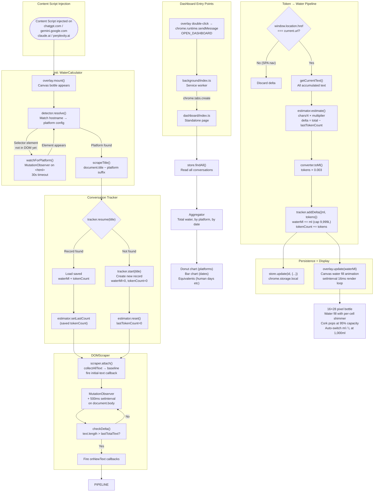

# Architecture Flow

Below is the complete data pipeline from content script injection to dashboard.

```mermaid
flowchart TD
  subgraph A[Content Script Injection]
    CS(["Content Script injected on<br/>chatgpt.com / gemini.google.com<br/>claude.ai / perplexity.ai"])
  end

  CS --> MOUNT

  subgraph B[Init: WaterCalculator]
    MOUNT["overlay.mount()<br/>Canvas bottle appears"]
    DETECT["detector.resolve()<br/>Match hostname → platform config"]
    MOUNT --> DETECT
    DETECT -->|"Selector element<br/>not in DOM yet"| WATCH["watchForPlatform()<br/>MutationObserver on &lt;html&gt;<br/>30s timeout"]
    WATCH -->|"Element appears"| DETECT
    DETECT -->|"Platform found"| TITLE["scrapeTitle()<br/>document.title − platform suffix"]
  end

  TITLE --> TRACK

  subgraph C[Conversation Tracker]
    TRACK{"tracker.resume(title)"}
    TRACK -->|"Record found"| LOAD["Load saved<br/>waterMl + tokenCount"]
    TRACK -->|"Not found"| START["tracker.start(title)<br/>Create new record<br/>waterMl=0, tokenCount=0"]
    LOAD --> SEED["estimator.setLastCount<br/>(saved tokenCount)"]
    START --> RSET["estimator.reset()<br/>lastTokenCount=0"]
  end

  SEED --> ATTACH
  RSET --> ATTACH

  subgraph D[DOMScraper]
    ATTACH["scraper.attach()<br/>collectAllText → baseline<br/>fire initial-text callback"]
    OBSERVE["MutationObserver<br/>+ 500ms setInterval<br/>on document.body"]
    ATTACH --> OBSERVE
    DELTA["checkDelta()<br/>text.length > lastTotalText?"]
    OBSERVE --> DELTA
    DELTA -->|"Yes"| CB["Fire onNewText callbacks"]
    DELTA -->|"No"| OBSERVE
  end

  CB --> PIPELINE

  subgraph E[Token → Water Pipeline]
    CB_URL{"window.location.href<br/>=== current.url?"}
    CB_URL -->|"No (SPA nav)"| DISCARD["Discard delta"]
    CB_URL -->|"Yes"| FT["getCurrentText()<br/>All accumulated text"]
    FT --> EST["estimator.estimate()<br/>chars/4 × multiplier<br/>delta = total − lastTokenCount"]
    EST --> CONV["converter.toMl()<br/>tokens × 0.003"]
    CONV --> ADD["tracker.addDelta({ml, tokens})<br/>waterMl += ml (cap 9,999L)<br/>tokenCount += tokens"]
  end

  ADD --> PERSIST
  ADD --> DISPLAY

  subgraph F[Persistence + Display]
    PERSIST["store.update(id, {...})<br/>chrome.storage.local"]
    DISPLAY["overlay.update(waterMl)<br/>Canvas water fill animation<br/>setInterval 16ms render loop"]
  end

  DISPLAY --> DISP_DETAIL["16×28 pixel bottle<br/>Water fill with per-cell shimmer<br/>Cork pops at 95% capacity<br/>Auto-switch ml / L at 1,000ml"]

  subgraph G[Dashboard Entry Points]
    DBL_CLICK["overlay double-click →<br/>chrome.runtime.sendMessage<br/>OPEN_DASHBOARD"]
    BG["background/index.ts<br/>Service worker"]
    DBL_CLICK --> BG
    BG -->|"chrome.tabs.create"| DB["dashboard/index.ts<br/>Standalone page"]
  end

  DB --> STORE_READ["store.findAll()<br/>Read all conversations"]
  STORE_READ --> AGG["Aggregator<br/>Total water, by platform, by date"]
  AGG --> CHARTS["Donut chart (platforms)<br/>Bar chart (dates)<br/>Equivalents (human days etc)"]
```
